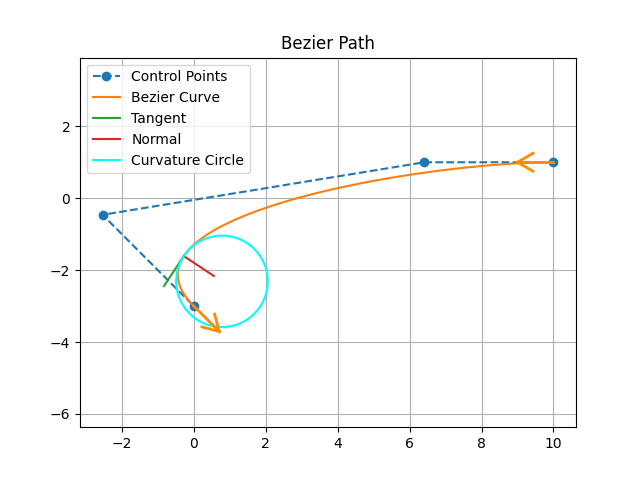

Overview
----------

Deterministic Search
--------------------

<table>
<tbody>
  <tr>
    <td></td>
    <td></td>
  </tr>
    <tr>
    <td></td>
    <td></td>
  </tr>
</tbody>
</table>

Stochastic Search
--------------------

<table>
<tbody>
  <tr>
    <td></td>
    <td></td>
  </tr>
  <tr>
    <td></td>
    <td></td>
  </tr>
    <tr>
    <td></td>

  </tr>
</tbody>
</table>

Spline Curve
----------

<table>
<tbody>
  <tr>
    <td></td>
    <td></td>
  </tr>
</tbody>
</table>

<!-- Polynomail Trajectory
--------------------- -->
<!--
<table>
<tbody>
  <tr>
    <td></td>
    <td></td>
  </tr>
</tbody>
</table> -->

Dubins/Reeds Shepp Curve
----------

<table>
<tbody>
  <tr>
    <td></td>
    <td></td>
  </tr>
</tbody>
</table>

Dynamic Window Approach
-----------------------

