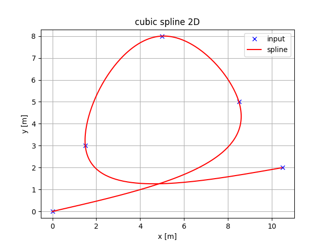

Overview
----------

Spline Interpolation
----------

<table>
<tbody>
  <tr>
    <td></td>
    <td></td>
  </tr>
</tbody>
</table>

Polynomail Curve
----------

<table>
<tbody>
  <tr>
    <td></td>
    <td></td>
  </tr>
</tbody>
</table>

Dubins/Reeds Shepp Curve
----------

<table>
<tbody>
  <tr>
    <td></td>
    <td></td>
  </tr>
</tbody>
</table>