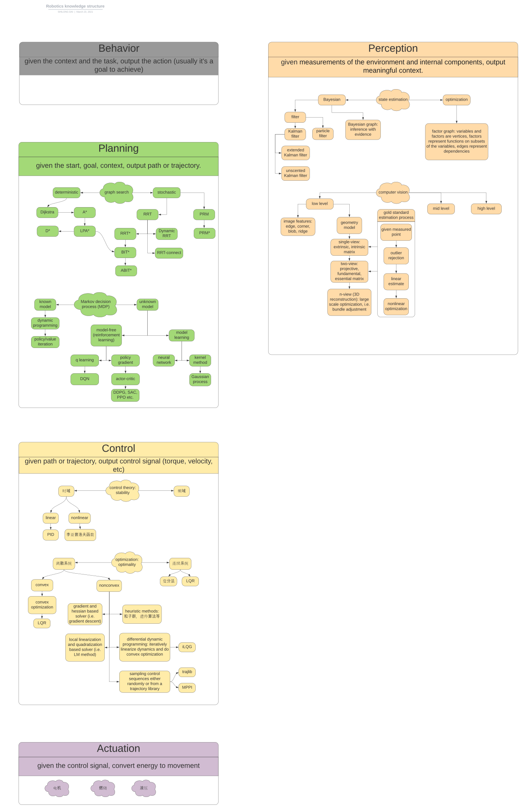

Overview
------------
This is a self arrangement of robotics knowledge.

Knowledge Structure
-------------------

Sample Code
-----------

- [Perception](Perception/)
- [Behavior](Behavior/)
- [Planning](Planning/)
- [Control](Control/)
- [Actuation](Actuation/)

Reference
---------

- [PathPlanning](https://github.com/zhm-real/PathPlanning)
- [MotionPlanning](https://github.com/zhm-real/MotionPlanning)
- [PythonRobotics](https://github.com/AtsushiSakai/PythonRobotics)