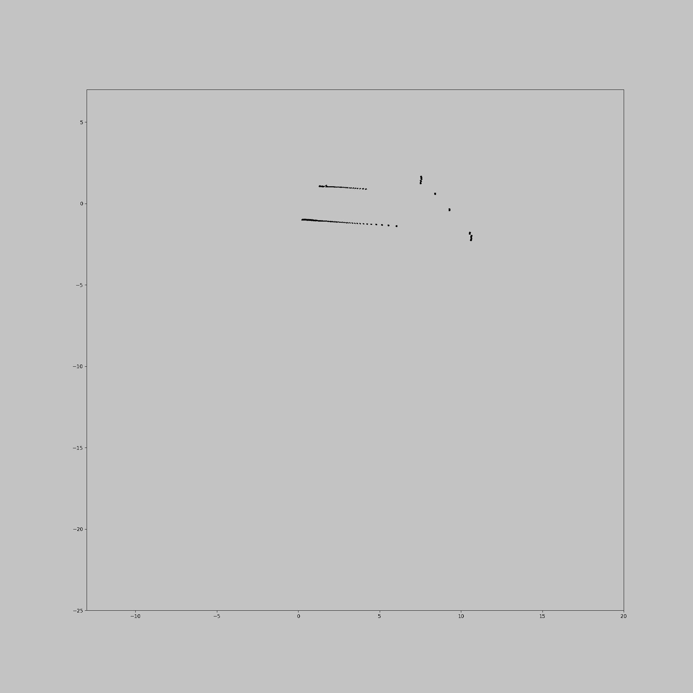

This projects contains my robotics knowledge and common robotics algorithm demo.

---------------------------------

## Perception

Edge features
--------------------

Key point features
-----------------------

ORB SLAM
---------

<iframe width="868" height="488" src="https://www.youtube.com/embed/GWl_Ffzc6oo" title="YouTube video player" frameborder="0" allow="accelerometer; autoplay; clipboard-write; encrypted-media; gyroscope; picture-in-picture" allowfullscreen></iframe>

GMapping
--------

-------------------------------------------------------------------

## Planning

Deterministic Search
--------------------

<table>
<tbody>
  <tr>
    <td></td>
    <td></td>
  </tr>
    <tr>
    <td></td>
    <td></td>
  </tr>
</tbody>
</table>

Stochastic Search
--------------------

<table>
<tbody>
  <tr>
    <td></td>
    <td></td>
  </tr>
  <tr>
    <td></td>
    <td></td>
  </tr>
    <tr>
    <td></td>

  </tr>
</tbody>
</table>

Potential Field
---------------

Spline Curve
----------

<table>
<tbody>
  <tr>
    <td></td>
    <td></td>
  </tr>
</tbody>
</table>

BSpline Curve
----------

<table>
<tbody>
  <tr>
    <td></td>
    <td></td>
    <td></td>
  </tr>
</tbody>
</table>

<table>
<tbody>
  <tr>
    <td></td>
    <td></td>
  </tr>
</tbody>
</table>

Dubins/Reeds Shepp Curve
----------

<table>
<tbody>
  <tr>
    <td></td>
    <td></td>
  </tr>
</tbody>
</table>

S-Curve Motion Profile
----------------------

Dynamic Window Approach
-----------------------

--------------------------------------------------

Fast Planner
------------

## Control

Two link arm
-------------

<table>
<tbody>
  <tr>
    <td></td>
    <td></td>
    <td></td>
    <td></td>
  </tr>
</tbody>
</table>

Car
---------

<table>
<tbody>
  <tr>
    <td></td>
    <td></td>
  </tr>
</tbody>
</table>
<table>
<tbody>
  <tr>
    <td></td>
    <td></td>
  </tr>
</tbody>
</table>

Quadcopter
----------

--------------------------------------------------

ref:

- [PathPlanning](https://github.com/zhm-real/PathPlanning)
- [MotionPlanning](https://github.com/zhm-real/MotionPlanning)
- [PythonRobotics](https://github.com/AtsushiSakai/PythonRobotics)